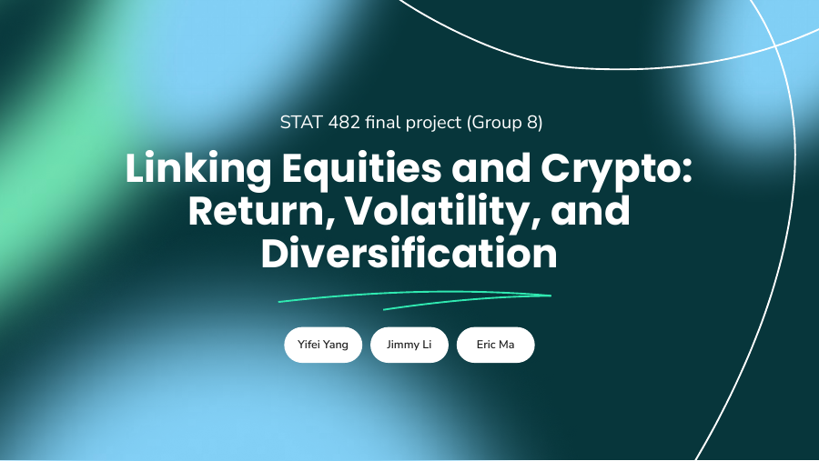
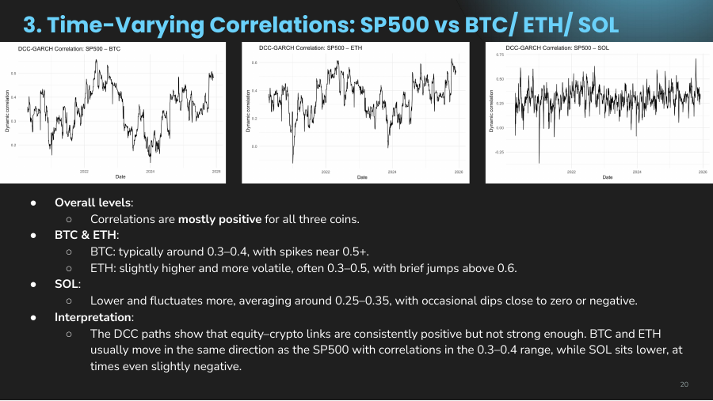
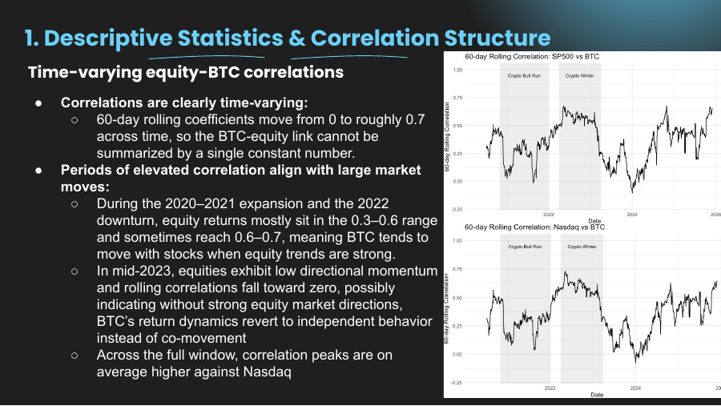
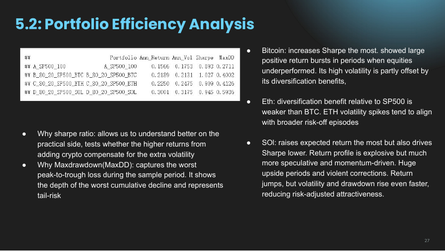
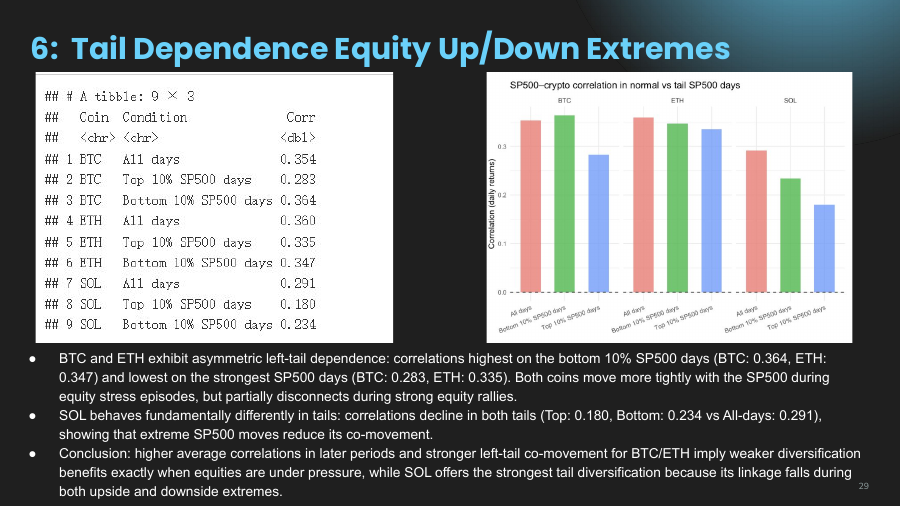

# Linking Equities and Crypto: Return, Volatility, and Diversification

A STAT 482 time-series project examining whether Bitcoin, Ethereum, and Solana diversify U.S. equity exposure or behave like high-beta extensions of stock-market risk.

<p align="center">
  <a href="presentation.pdf">
    
  </a>
</p>

<p align="center">
  <strong><a href="presentation.pdf">View the presentation</a></strong>
  &nbsp;&nbsp;|&nbsp;&nbsp;
  <strong><a href="reports/equity_crypto_analysis.html">Open the rendered analysis</a></strong>
</p>

## Project overview

The analysis compares two U.S. equity indices - the S&P 500 and Nasdaq Composite - with three major crypto assets: Bitcoin (BTC), Ethereum (ETH), and Solana (SOL). It studies four related questions:

1. How strongly do equity and crypto returns move together?
2. Does either market help predict the other?
3. How do correlations and volatility linkages change across market regimes?
4. Does a small crypto allocation improve an equity portfolio's risk-adjusted performance?

Daily closing prices are downloaded from Yahoo Finance beginning on January 1, 2018. The series are aligned on dates for which all five assets have valid observations, then converted to daily and weekly log returns.

## Methods

- Descriptive return and risk statistics
- Daily and weekly correlation matrices
- 60-day rolling correlations with market-event overlays
- Vector autoregression, Granger-causality tests, and impulse-response functions
- Bivariate DCC-GARCH models for time-varying equity-crypto correlations
- 21-day annualized realized volatility and volatility-spillover tests
- 80/20 S&P 500-crypto portfolio comparisons
- Regime, tail-correlation, and joint-crash analysis

## Main findings

### Dependence is positive but unstable

Equity-crypto correlations are moderate rather than negligible, and they vary substantially over time. The DCC-GARCH estimates reported in the presentation are:

| Crypto asset | Mean correlation with S&P 500 | Minimum | Maximum |
|---|---:|---:|---:|
| BTC | 0.344 | 0.125 | 0.559 |
| ETH | 0.350 | -0.121 | 0.629 |
| SOL | 0.303 | -0.364 | 0.709 |

The wide ranges show why a single full-sample correlation can hide important changes in diversification potential.



### Return spillovers are weak and short-lived

VAR, Granger-causality, and impulse-response results provide little evidence of stable forecasting power between equities and crypto. Equity shocks sometimes lead short-lived crypto responses, but crypto returns rarely predict the S&P 500 or Nasdaq. The presentation interprets crypto as reacting to broad market conditions more often than leading them.



### Crypto raises both return and risk in the 80/20 portfolios

The submitted project snapshot compares a 100% S&P 500 portfolio with fixed 80/20 equity-crypto mixes:

| Portfolio | Annualized return | Annualized volatility | Sharpe ratio | Max drawdown magnitude |
|---|---:|---:|---:|---:|
| 100% S&P 500 | 15.66% | 17.53% | 0.893 | 27.11% |
| 80% S&P 500 / 20% BTC | 21.89% | 21.31% | 1.027 | 40.02% |
| 80% S&P 500 / 20% ETH | 22.50% | 24.75% | 0.909 | 41.26% |
| 80% S&P 500 / 20% SOL | 30.01% | 31.75% | 0.945 | 59.36% |

All three mixes increase the sample-period Sharpe ratio, but they also produce larger volatility and drawdowns. BTC offers the strongest risk-adjusted improvement in this comparison, while SOL generates the highest return and the most severe drawdown.



### Diversification weakens in important stress states

BTC and ETH become more correlated with the S&P 500 on its bottom-decile days. Their reported downside correlations are 0.364 and 0.347, respectively, which means their diversification value is weaker when equities are under pressure. SOL behaves differently in this sample, with lower correlation in both equity-market tails.



### Most crypto volatility remains crypto-specific

Crypto's 21-day realized volatility is generally three to five times the S&P 500's. Regressions using absolute S&P 500 and Nasdaq returns explain less than 0.5% of the variation in crypto realized volatility, suggesting that broad equity shocks matter only at the margin.

## Repository contents

| Path | Description |
|---|---|
| [`presentation.pdf`](presentation.pdf) | Final 38-slide presentation |
| [`analysis/equity_crypto_analysis.Rmd`](analysis/equity_crypto_analysis.Rmd) | Primary R Markdown analysis |
| [`analysis/extended_analysis.Rmd`](analysis/extended_analysis.Rmd) | Extended analysis with additional interpretations and outputs |
| [`analysis/development_notebook.Rmd`](analysis/development_notebook.Rmd) | Earlier development version retained for transparency |
| [`reports/equity_crypto_analysis.html`](reports/equity_crypto_analysis.html) | Rendered output from the primary analysis |
| [`reports/development_render.html`](reports/development_render.html) | Earlier rendered analysis |
| [`assets/`](assets/) | Selected presentation figures used in this README |

## Run locally

### 1. Clone the repository

```bash
git clone https://github.com/yangyifei877-web/Equity-Crypto-Return-Volatility-and-Diversification.git
cd Equity-Crypto-Return-Volatility-and-Diversification
```

### 2. Install R packages

R 4.3 or newer is recommended. From a terminal:

```bash
Rscript install_packages.R
```

Or open `install_packages.R` in RStudio or VS Code and run it interactively. The DCC-GARCH packages may require compilation tools: Xcode Command Line Tools on macOS or Rtools on Windows. Rendering also requires Pandoc; RStudio includes a compatible copy, while command-line-only setups may need Pandoc installed separately.

### 3. Render the analysis

```bash
Rscript -e 'rmarkdown::render("analysis/equity_crypto_analysis.Rmd")'
```

The analysis downloads market prices from Yahoo Finance, so an internet connection is required. Because the source code requests all available observations after `2018-01-01`, a new run can include later dates or revised prices and may not exactly match the archived presentation and HTML results.

## Interpretation notes

- Granger causality measures predictive content, not structural or economic causation.
- The sample is dominated by COVID-19, the 2021 crypto expansion, and the post-2022 tightening cycle.
- The study covers only two U.S. large-cap equity indices and three crypto assets.
- The portfolio comparison uses fixed 80/20 weights, a zero risk-free rate for Sharpe ratios, and no transaction costs or taxes.
- Crypto trades continuously, but the common-date alignment limits the panel to dates shared with equity markets.

## Contributors

STAT 482 final project by Yifei Yang, Jimmy Li, and Eric Ma.

## Disclaimer

This repository is for academic research and educational purposes only. It does not constitute financial or investment advice.
